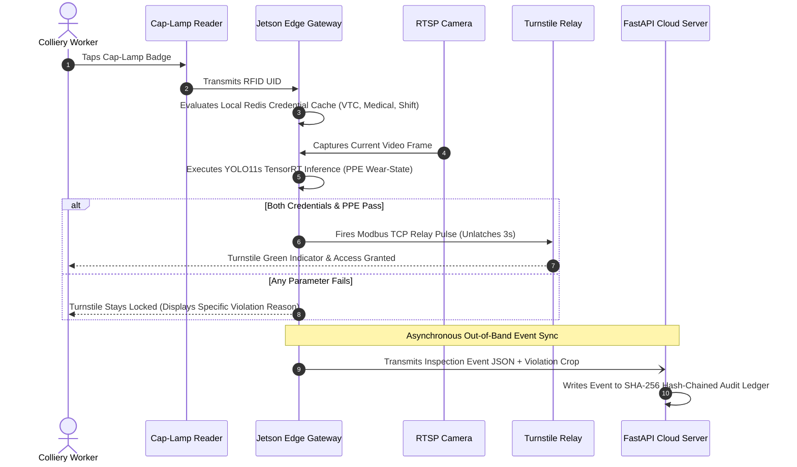
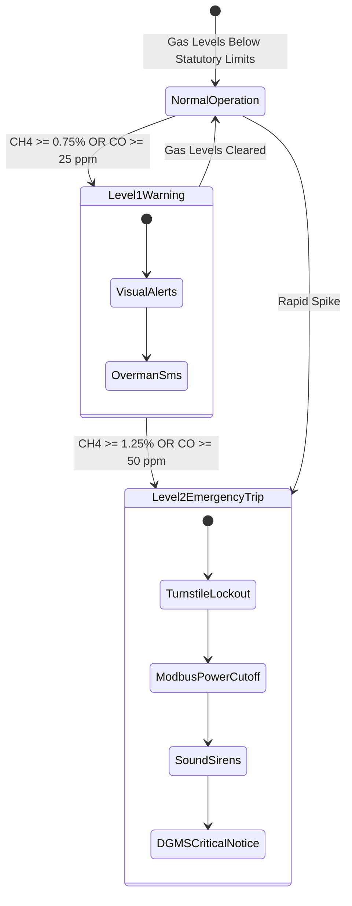

# CoalGuard — System Architecture & Topology Specification

> **Document Status:** Active / Production Baseline  
> **Version:** 2.4.0  
> **Regulatory Standard:** Coal Mines Regulations (CMR 2017) / DGMS Technical Directives  
> **Target Audience:** Systems Architects, Embedded Engineers, DevOps, DGMS Audit Officers

---

## Executive Summary

**CoalGuard** is an integrated AI-enabled governance, safety, and compliance monitoring platform engineered for Indian opencast and underground coal collieries. It bridges the gap between extreme sub-surface physical mining constraints (zero GPS, optical darkness, volatile atmospheric gases, intermittent network backhaul) and enterprise-grade regulatory administration.

The architecture decouples mission-critical safety arbitration from administrative aggregation. High-throughput edge inference engines arbitrate personnel shaft access with sub-500ms latency independent of wide-area network (WAN) connectivity, while an immutable, hash-chained backend guarantees non-repudiation for regulatory oversight.

---

## Table of Contents

1. [End-to-End System Topology](#1-end-to-end-system-topology)
   - [1.1 Architectural Principles](#11-architectural-principles)
   - [1.2 Three-Tier Operational Boundaries](#12-three-tier-operational-boundaries)
2. [Architecture Diagrams](#2-architecture-diagrams)
   - [2.1 Visual Component Architecture (Mermaid)](#21-visual-component-architecture-mermaid)
   - [2.2 Detailed End-to-End Topology Map](#22-detailed-end-to-end-topology-map)
3. [Architectural Layer Deep-Dives](#3-architectural-layer-deep-dives)
   - [3.1 Layer 1: Edge & Field Layer (Capture & Actuate)](#31-layer-1-edge--field-layer-capture--actuate)
   - [3.2 Layer 2: Enterprise Backend Layer (Process, Govern & Store)](#32-layer-2-enterprise-backend-layer-process-govern--store)
   - [3.3 Layer 3: Presentation & Command Layer (Visualize & Control)](#33-layer-3-presentation--command-layer-visualize--control)
4. [Core Architectural Patterns](#4-core-architectural-patterns)
   - [4.1 Edge Arbitration (Sub-500ms Local Gate Decision)](#41-edge-arbitration-sub-500ms-local-gate-decision)
   - [4.2 Out-of-Band Low-Latency Video Delivery](#42-out-of-band-low-latency-video-delivery)
   - [4.3 Dual-Store Strategy (Relational ACID vs. Time-Series Hypertables)](#43-dual-store-strategy-relational-acid-vs-time-series-hypertables)
   - [4.4 Resilient Offline-First Delta-Sync Engine](#44-resilient-offline-first-delta-sync-engine)
   - [4.5 Tamper-Evident SHA-256 Hash-Chained Audit Ledger](#45-tamper-evident-sha-256-hash-chained-audit-ledger)
5. [Hardware Interfacing & Telemetry Bus](#5-hardware-interfacing--telemetry-bus)
   - [5.1 Industrial Protocol Matrix](#51-industrial-protocol-matrix)
   - [5.2 Gas Interlock & Statutory Trip Matrix](#52-gas-interlock--statutory-trip-matrix)
6. [Communication Protocol Matrix](#6-communication-protocol-matrix)
7. [Security, Resilience & Edge Fail-Safe Protocols](#7-security-resilience--edge-fail-safe-protocols)
   - [7.1 Offline Network Partition Protocol](#71-offline-network-partition-protocol)
   - [7.2 Fail-Secure vs. Emergency Fail-Safe States](#72-fail-secure-vs-emergency-fail-safe-states)
   - [7.3 Cryptographic Standards](#73-cryptographic-standards)

---

## 1. End-to-End System Topology

### 1.1 Architectural Principles

```
  ┌─────────────────┐       ┌─────────────────┐       ┌─────────────────┐
  │  EDGE AUTONOMY  │  ───► │ TAMPER EVIDENCE │  ───► │ STREAM DECOUPLING│
  │ Zero-WAN Bypass │       │ Linear SHA-256  │       │ Out-of-Band RTSP│
  └─────────────────┘       └─────────────────┘       └─────────────────┘
```

1. **Edge Autonomy:** Shift changes at mine pitheads involve hundreds of workers within narrow dispatch windows. The access turnstile gate must arbitrate access decisions locally without depending on cloud connectivity or experiencing network latency spikes.
2. **Zero-Trust Access Control:** Optical PPE detection and biometric/RFID verification are mutually required. Neither physical credential validation nor visual PPE confirmation is sufficient on its own.
3. **Immutability & Non-Repudiation:** Statutory safety logs cannot be edited or purged. Every governance action, inspection record, and violation status transition forms a cryptographically linked SHA-256 chain.
4. **Out-of-Band Video Streaming:** High-bandwidth surveillance video streams bypass the central application server entirely. Video frames flow directly from edge cameras/proxies to clients via WebRTC, while lightweight bounding-box metadata flows over WebSockets.
5. **Decoupled Relational & Telemetry Stores:** Structured statutory records are stored under ACID relational guarantees in PostgreSQL, while high-frequency telemetry streams are routed to TimescaleDB hypertables.

### 1.2 Three-Tier Operational Boundaries

| Tier | Deployment Domain | Primary Functions | Key Technologies |
| :--- | :--- | :--- | :--- |
| **Layer 1: Edge & Field** | Pithead Shaft-Collar & Underground Galleries | Real-time PPE inference, RFID credential checks, relay actuation, offline digital inspections | NVIDIA Jetson, YOLO11s, Modbus TCP, Flutter, SQLite (Drift) |
| **Layer 2: Enterprise Backend** | Colliery Server Room / Regional Cloud | Workforce governance, SLA remediation engine, document OCR/NER, telemetry aggregation | FastAPI (Python 3.12), PostgreSQL 16 + PostGIS, TimescaleDB, Redis 7, Celery |
| **Layer 3: Presentation & Command** | Colliery Surface Control Room & DGMS Auditor Dashboards | WebRTC gate HUD, spatial GIS lease visualization, statutory Kanban, audit ledger verification | React 19, TypeScript, Vite, MapLibre GL, Tailwind CSS |

---

## 2. Architecture Diagrams

### 2.1 Visual Component Architecture (Mermaid)

```mermaid
flowchart TD
    %% Subgraphs for Physical & Logical Separation
    subgraph L1["1. EDGE & FIELD LAYER (Colliery & Sub-Surface)"]
        direction TB
        subgraph Sub_Pithead["Pithead Shaft-Collar Gateway"]
            CAM["1080p RTSP Camera\n(5000K Lighting Corridor)"]
            GATEWAY["Edge Gateway Mini-PC\n(NVIDIA Jetson / TensorRT)"]
            YOLO["YOLO11s Direct\nWear-State Engine"]
            RFID["Cap-Lamp RFID / Wiegand\nReader Terminal"]
            RELAY["Modbus TCP Relay /\nPLC Interlock"]
            MEDIAMTX["MediaMTX\nRTSP-to-WebRTC Bridge"]
        end

        subgraph Sub_Field["Mobile Auditing & Undergound Workings"]
            MOBILE["Field Inspector App\n(Flutter + Drift SQLite)"]
            SEAM_TAGS["Underground Seam Beacons\n(NFC / Passive BLE)"]
            ETD["Electronic Gas Sensors\n(CH4, CO, Airflow ETDs)"]
        end
    end

    subgraph L2["2. ENTERPRISE BACKEND LAYER (On-Premises Server / Hybrid Cloud)"]
        direction TB
        API["FastAPI Enterprise Gateway\n(OAuth2, RBAC, Pydantic v2)"]
        SLA_SVC["SLA Remediation Service\n(Statutory Clock Escalation)"]
        HASH_SVC["Hash-Chain Audit Service\n(SHA-256 Ledger Anchor)"]
        WORKER["Celery Task Workers\n(PaddleOCR + LayoutLMv3)"]
        TELEMETRY_HUB["Hardware Telemetry Hub\n(Node.js / Mosquitto MQTT)"]
        
        subgraph Sub_DataStores["Enterprise Storage Tier"]
            PG["PostgreSQL 16\n(Relational ACID + RBAC)"]
            GIS["PostGIS 3.4\n(Spatial Mine Geometry)"]
            TSDB["TimescaleDB\n(Telemetry Hypertables)"]
            REDIS["Redis 7\n(Pub/Sub, Worker Queue, Cache)"]
        end
    end

    subgraph L3["3. PRESENTATION & COMMAND LAYER (Surface Control Room)"]
        direction TB
        subgraph Sub_Portal["React 19 Enterprise Web Portal"]
            HUD["Live Gate HUD\n(HTML5 Canvas Overlays)"]
            MAP["GIS Spatial Map\n(MapLibre GL Vector Tiles)"]
            KANBAN["Statutory Remediation\nKanban Board"]
            AUDIT_VIEW["DGMS Cryptographic\nAudit Ledger"]
        end
    end

    %% Inter-tier Data Flows
    CAM -->|"RTSP Feed (H.264)"| GATEWAY
    GATEWAY --> YOLO
    YOLO -->|"PPE State Result"| GATEWAY
    RFID -->|"Wiegand / RS-485"| GATEWAY
    GATEWAY -->|"Modbus Output Pulse"| RELAY
    CAM -->|"Raw Video Stream"| MEDIAMTX
    MEDIAMTX ==>|"Direct WebRTC Video (Out-of-Band)"| HUD

    MOBILE -.->|"NFC Tap (Topological Fix)"| SEAM_TAGS
    MOBILE ==>|"Tus.io Resumable Sync (Protobuf)"| API
    ETD -->|"Modbus RTU / 4-20mA"| TELEMETRY_HUB

    GATEWAY -->|"Async Event Metadata (JSON/REST)"| API
    API --> SLA_SVC
    API --> HASH_SVC
    API --> WORKER
    TELEMETRY_HUB -->|"Sensor Telemetry Streams"| TSDB
    TELEMETRY_HUB -->|"Critical Gas Breaches"| REDIS

    SLA_SVC --> PG
    HASH_SVC --> PG
    WORKER --> PG
    API --> PG
    API --> GIS
    API --> REDIS

    REDIS -->|"WebSockets (Telemetry, Alerts, Boxes)"| Sub_Portal
    API -->|"REST APIs (JSON)"| Sub_Portal
    GIS -->|"MVT Vector Tile Stream"| MAP

    %% Styling
    classDef edge fill:#1e293b,stroke:#0284c7,stroke-width:2px,color:#f8fafc;
    classDef backend fill:#0f172a,stroke:#6366f1,stroke-width:2px,color:#f8fafc;
    classDef frontend fill:#1e1e2e,stroke:#10b981,stroke-width:2px,color:#f8fafc;
    classDef store fill:#18181b,stroke:#f59e0b,stroke-width:2px,color:#f8fafc;

    class CAM,GATEWAY,YOLO,RFID,RELAY,MEDIAMTX,MOBILE,SEAM_TAGS,ETD edge;
    class API,SLA_SVC,HASH_SVC,WORKER,TELEMETRY_HUB backend;
    class HUD,MAP,KANBAN,AUDIT_VIEW frontend;
    class PG,GIS,TSDB,REDIS store;
```



---

### 2.2 Detailed End-to-End Topology Map

```text
========================================================================================================================
                                     1. EDGE & FIELD LAYER (The Mine Site)
========================================================================================================================

  [SURFACE & UNDERGROUND FIELD OPS]                           [PITHEAD SHAFT-COLLAR CHECKPOINT]
  
  +---------------------------------------+                   +---------------------------------------+
  |    Field Inspector Mobile App         |                   |         Pithead Edge Gateway          |
  |    (Flutter + Drift SQLite)           |                   |       (NVIDIA Jetson / Mini-PC)       |
  |                                       |                   |                                       |
  |  * CMR 2017 Digital Checklists        |                   |  +---------------------------------+  |
  |  * Offline-First Storage              |                   |  |  RTSP Camera: 1080p @ 30 FPS    |  |
  |  * Dual Tagging (GPS + NFC/BLE)       |                   |  +----------------┬----------------+  |
  +-------------------┬-------------------+                   |                   │                   |
                      │ (Auto-Sync upon Wi-Fi)                |                   ▼                   |
                      │                                       |  +---------------------------------+  |
                      ▼                                       |  | DeepStream / TensorRT (YOLO11s) |  |
            [Tus.io / Protobuf API]                           |  | Direct State Wear Classification|  |
                      │                                       |  +----------------┬----------------+  |
                      │                                       |                   │                   |
                      │                                       |  +----------------┴----------------+  |
                      │                                       |  | Cap-Lamp RFID / Wiegand Reader  |  |
                      │                                       |  +----------------┬----------------+  |
                      │                                       |                   │                   |
                      │                                       |                   ▼                   |
                      │                                       |      [Access Policy Evaluator]        |
                      │                                       |       /                      \        |
                      │                                       | (COMPLIANT)              (VIOLATION)  |
                      │                                       |     │                         │       |
                      │                                       |     ▼                         ▼       |
                      │                                       | [Modbus Relay Pulse]     [Lock Gate]  |
                      │                                       +---------┬──────────────────┬----------+
                      │                                                 │                  │
                      │                              (Metadata / JSON)  │                  │ (WebRTC)
                      │                                                 ▼                  ▼
======================╪=================================================╪==================╪===========================
                      │           2. ENTERPRISE BACKEND LAYER (On-Prem Server / Cloud)     │
======================╪=================================================╪==================╪===========================
                      │                                                 │                  │
                      ▼                                                 ▼                  │
  +-------------------------------------------------------------------------------------+  │
  |                          FastAPI Enterprise Gateway                                 |  │
  |                                                                                     |  │
  |  * OAuth2 & RBAC Engine                                                             |  │
  |  * Worker Credential Resolver (VTC, Medical, Shift Overtime Guard)                  |  │
  |  * SLA Remediation State Machine (Detected -> Verified -> Resolved -> Closed)       |  │
  |  * SHA-256 Hash-Chained Audit Ledger (Tamper-Evident Logic)                         |  │
  +-------------------------┬───────────────────────────┬──────────────────────────────-+  │
                            │                           │                                  │
                            ▼                           ▼                                  │
  +-----------------------------------+   +------------------------------------+           │
  |     Hardware Telemetry Hub        |   |   Document Digitization Pipeline   |           │
  |      (Node.js / Mosquitto)        |   |     (Celery Worker + PaddleOCR)    |           │
  |                                   |   |                                    |           │
  | * Modbus / OPC-UA / MQTT Adapters |   | * Image Deskewing & Binarization   |           │
  | * Device Heartbeat Diagnostics    |   | * LayoutLMv3 Entity Extraction     |           │
  | * Environmental Gas Interlocks    |   | * Validity / Expiry Parsing        |           │
  +-----------------┬-----------------+   +-----------------┬------------------+           │
                    │                                       │                              │
                    ▼                                       ▼                              │
  +-------------------------------------------------------------------------------------+  │
  |                               Storage & Messaging Bus                               |  │
  |                                                                                     |  │
  |  * PostgreSQL 16 + PostGIS 3.4 : Relational Data, RBAC, Spatial Mine Geometry       |  │
  |  * TimescaleDB Engine          : Time-Series Environmental Telemetry (CH4, CO)      |  │
  |  * Redis 7                     : Caching, Pub/Sub Alerting, Celery Task Queues      |  │
  +-------------------------------------------------------------┬-----------------------+  │
                                                                │                          │
                                                                │ WebSockets (JSON)        │
                                                                ▼                          │
===========================================================================================╪===========================
                                   3. PRESENTATION & COMMAND LAYER (Control Room)          │
===========================================================================================╪===========================
                                                                                           │
  +-------------------------------------------------------------------------------------+  │
  |                   React 19 + TypeScript + Vite Enterprise Web Portal                |  │
  |                                                                                     |  │
  |   +-----------------------------+  +-------------------------------+                |  │
  |   |    Pithead Live Gate HUD    |  |     Mine Spatial GIS Map      |                |  │
  |   |  - Native WebRTC Video ◄────┼──┼───────────────────────────────┼────────────────┼──┘
  |   |  - HTML5 Canvas Overlays    |  |  - MapLibre GL Vector Tiles   |                |
  |   |  - Real-time Gate Status    |  |  - Lease vs Active Bench Geo  |                |
  |   +-----------------------------+  +-------------------------------+                |
  |                                                                                     |
  |   +-----------------------------+  +-------------------------------+                |
  |   |   Diagnostic Health Matrix  |  |  Statutory Compliance Center  |                |
  |   |  - Sensor Heartbeat Monitor |  |  - SLA Escalation Kanban      |                |
  |   |  - Ping / Packet Loss Stats |  |  - Hash-Chained Audit Ledger  |                |
  |   +-----------------------------+  +-------------------------------+                |
  +-------------------------------------------------------------------------------------+
```

---

## 3. Architectural Layer Deep-Dives

### 3.1 Layer 1: Edge & Field Layer (Capture & Actuate)

The Edge & Field Layer operates inside the harsh environmental boundaries of the colliery. It is subdivided into two distinct environments:

#### A. Pithead Smart Gate (Shaft-Collar Checkpoint)
* **NVIDIA Jetson / Edge Mini-PC:** Deployed in an industrial IP66-rated enclosure at the man-winding shaft entrance. Runs an optimized **NVIDIA TensorRT** engine executing **YOLO11s**.
* **Engineered Choke Corridor:** Eliminates environmental variability through physical design:
  * Single-file channel forcing 1.8m to 2.2m standoff distance.
  * Floor-painted footprint markers establishing a fixed focal plane.
  * 5000K overhead high-CRI illumination eliminating deep shadow cast underground.
* **Direct Wear-State Inference:** Does not run skeletal keypoint tracking. Instead, directly classifies target bounding boxes into explicit states:
  * `hardhat_worn` vs `head_bare`
  * `vest_worn` vs `vest_absent`
  * `scsr_worn` (Self-Contained Self-Rescuer) vs `scsr_absent`
* **Cap-Lamp / RFID Scanner:** Reads Wiegand-26/34 or RS-485 badge transmissions from workers' mandatory cap-lamps or smart identity cards.
* **Modbus TCP / Relay Actuator:** Drives the physical turnstile solenoid lock. Unlatches for a 3-second cycle only upon positive confirmation of both biometric PPE and credential authorization.

#### B. Field Auditing & Sub-Surface Operations
* **Field Inspector Mobile Client:** Flutter application with offline-first persistence using **Drift (SQLite)**. Enables statutory DGMS inspectors and Overmen to log Form IV daily checklists, strata inspections, and hazard tickets.
* **Dual-Tagging Topological Fixes:**
  * *Surface Operations:* Tags audits with standard WGS84 GPS latitude/longitude.
  * *Underground Operations:* Replaces non-functional GPS with topological hierarchy fixes (`Mine -> Seam -> Incline -> Level -> Pillar`) validated by scanning encrypted NFC tokens or BLE beacons fixed to gallery roof supports.

---

### 3.2 Layer 2: Enterprise Backend Layer (Process, Govern & Store)

The Backend Layer serves as the central administrative and compliance clearinghouse:

* **FastAPI Application Gateway (Python 3.12+):**
  * Fully asynchronous request handling via `asyncpg` and Uvicorn.
  * JWT authentication with granular Role-Based Access Control (`MINER`, `OVERMAN`, `SAFETY_OFFICER`, `COLLIERY_MANAGER`, `DGMS_AUDITOR`).
  * End-to-end Pydantic v2 schema enforcement ensuring strict data typing across all endpoints.
* **Statutory SLA Remediation Engine:**
  * Celery beat worker evaluating open safety violations against statutory response times (e.g., 24 hours for Critical, 72 hours for Major).
  * Automatically transitions ticket states: `DETECTED` $\rightarrow$ `NOTICE_SERVED` $\rightarrow$ `ACTION_TAKEN` $\rightarrow$ `RESOLVED` $\rightarrow$ `CLOSED`.
  * Triggers supervisory escalations via SMS/Email/In-App notifications when statutory deadlines expire.
* **Document Digitization & OCR Pipeline:**
  * Celery worker task executing **PaddleOCR** for document deskewing, binarization, and Indian colliery certificate text extraction.
  * **LayoutLMv3** parses key fields from statutory documents (VTC training cards, Form B statutory employee registers, Form O medical clearance records).
* **Hardware Telemetry Hub:**
  * Ingests real-time environmental metrics (Methane $\text{CH}_4$, Carbon Monoxide $\text{CO}$, air velocity, and temperature) from colliery SCADA systems and Electronic Telemonitoring Devices (ETDs).
  * Interfaces with industrial equipment via MQTT (EMQX/Mosquitto), OPC-UA, and Modbus TCP.

---

### 3.3 Layer 3: Presentation & Command Layer (Visualize & Control)

The Presentation Layer provides unified single-pane-of-glass situational awareness:

* **React 19 + TypeScript Single-Page Portal:** Modern reactive architecture built with Vite, Tailwind CSS, and Lucide icons.
* **Pithead Live Gate HUD:**
  * Displays direct WebRTC video feed from pithead cameras with sub-second latency.
  * Renders bounding-box overlays and compliance indicators on an HTML5 canvas layer aligned precisely with video frames.
* **MapLibre GL Vector GIS Engine:**
  * Renders Mapbox Vector Tiles (MVT) generated directly from PostGIS geometries.
  * Overlays official DGMS colliery lease boundaries, active bench contours, blasting exclusion radiuses, and underground seam gallery centerlines.
* **DGMS Statutory Audit Center:**
  * Visualizes the linear SHA-256 cryptographic audit chain.
  * Allows compliance officers to run client-side verification of any inspection record or violation ticket against its cryptographic predecessor.

---

## 4. Core Architectural Patterns

### 4.1 Edge Arbitration (Sub-500ms Local Gate Decision)

To prevent severe shift change bottlenecks where hundreds of workers queue at the shaft collar, access decisions **never** depend on a synchronous cloud round-trip.



1. The Edge Gateway maintains a local **Redis cache** synchronized every 24 hours (with incremental delta pushes) containing valid worker credentials.
2. The YOLO11s model evaluates wear compliance locally within ~40ms on TensorRT.
3. The arbitration logic evaluates local eligibility and optical compliance concurrently.
4. The Modbus relay command is issued locally over Ethernet.
5. Telemetry metadata is batched and queued asynchronously to the central server via REST/WebSockets. If the WAN connection is severed, events are buffered in local SQLite storage.

---

### 4.2 Out-of-Band Low-Latency Video Delivery

Routing continuous multi-camera 1080p RTSP video streams through a Python application backend degrades CPU throughput and introduces unacceptable streaming latency.

```
+-------------+               RTSP (H.264)              +---------------+
| RTSP Camera | ──────────────────────────────────────► |   MediaMTX    |
+-------------+                                         | (Edge Gateway)|
                                                        +-------┬-------+
                                                                │ WebRTC Direct
+---------------------+    WebSocket JSON (Bounding Boxes)      │ (Sub-500ms)
|  React 19 Frontend  | ◄───────────────────────────────────────┤
| (HTML5 Canvas HUD)  | ◄───────────────────────────────────────┘
+---------------------+
```

* **The MediaMTX Edge Bridge:** Cameras output standard H.264 RTSP feeds to a local MediaMTX instance running on the Edge Gateway. MediaMTX transcodes the stream on-the-fly to native WebRTC.
* **Direct Browser Peering:** The React 19 web portal establishes a direct WebRTC peer connection to MediaMTX.
* **Separation of Video & Annotations:** Video frames stream without modification. The FastAPI backend transmits bounding-box coordinates, detection confidence scores, and personnel metadata over WebSockets. The React frontend paints these annotations on an HTML5 `<canvas>` overlay overlaid on the HTML5 `<video>` element.

---

### 4.3 Dual-Store Strategy (Relational ACID vs. Time-Series Hypertables)

The platform isolates transactional governance workflows from high-velocity industrial telemetry:

```
                                  DATA INGESTION
                                        │
                 ┌──────────────────────┴──────────────────────┐
                 ▼                                             ▼
       [Transactional Entity]                        [Sensor Telemetry]
     Workforce, RBAC, Audits                     Gas Levels, Fan RPM, Relays
                 │                                             │
                 ▼                                             ▼
        PostgreSQL 16 Engine                         TimescaleDB Hypertables
     (ACID, Foreign Keys, PostGIS)                (Time-Partitioned Chunks)
                 │                                             │
                 ▼                                             ▼
        Relational Integrity                       Sub-Millisecond Aggregation
```

1. **PostgreSQL 16 (Relational & Spatial):**
   * Manages workforce credentials, role hierarchies, incident remediation workflows, and digital checklists.
   * Leverages **PostGIS 3.4** for spatial bounding boxes, polygonal lease boundaries, and 3D sub-surface mine galleries.
   * Enforces foreign key constraints and transactional rollback safety.
2. **TimescaleDB Engine (Hypertables):**
   * Automatically partitions incoming sensor readings into time-based physical chunks (e.g., 1-day intervals).
   * Ingests high-frequency environmental data ($\text{CH}_4$, $\text{CO}$, air velocity, vibration) at thousands of samples per second without indexing overhead locking the relational workforce tables.
   * Employs continuous aggregates to generate real-time 1-minute, 1-hour, and 24-hour compliance rollups for statutory reporting.

---

### 4.4 Resilient Offline-First Delta-Sync Engine

Sub-surface galleries frequently lack optical fiber connectivity, leaving inspectors completely disconnected from corporate networks.

```
[Mobile SQLite (Drift)]
        │
        ├─ 1. Generate Audit Record with Client UUID
        ├─ 2. Write Binary Delta to Local SQLite Journal
        │
  (Exit Mine / Connect to Colliery Wi-Fi)
        │
        ├─ 3. Tus.io Resumable HTTP POST / Protobuf Stream
        ▼
[FastAPI Enterprise Backend]
        │
        ├─ 4. Check Idempotency Key in Redis / DB
        ├─ 5. Insert Record into PostgreSQL & Compute Hash Chain
        └─ 6. Return Synced Ack with Server Timestamp
```

* **Drift ORM (SQLite):** All audit evaluations, safety checklists, and photographic evidence are committed to local SQLite databases on the Android mobile terminal.
* **Idempotency Guarantees:** Every entity is generated with a client-side UUIDv4 idempotency key. If a sync session drops halfway through an underground shift, resending identical packets causes zero duplicate records on the central server.
* **Decoupled Resumable Binary Payloads:**
  * Audit structured fields are serialized into compact **Protocol Buffers** payloads.
  * Photo/video evidence files are transferred independently via **Tus.io** protocol endpoints supporting chunked, pause-and-resume uploads across unstable industrial Wi-Fi access points.

---

### 4.5 Tamper-Evident SHA-256 Hash-Chained Audit Ledger

To comply with DGMS non-repudiation mandates and prevent malicious retroactive modification of safety books, all statutory logs are cryptographically linked in a linear hash chain.

$$\text{Current Hash} = \text{SHA-256}\left(\text{Previous Hash} \parallel \text{Timestamp} \parallel \text{Actor UUID} \parallel \text{Action Type} \parallel \text{Payload JSON}\right)$$

```
+─────────────────────────────+        +─────────────────────────────+
|       Audit Record N-1      |        |       Audit Record N        |
|-----------------------------|        |-----------------------------|
| Record ID: UUID-101         |        | Record ID: UUID-102         |
| Action: "VIOLATION_LOGGED"  |        | Action: "STATUS_ESCALATED"  |
| Prev Hash: 0000abc1...      | ───┐   | Prev Hash: 7b29e01f... ◄────┼── (Linked)
| Record Hash: 7b29e01f...    | ───┴─► | Record Hash: 3c91df44...    |
+─────────────────────────────+        +─────────────────────────────+
```

* **Append-Only Enforcement:** Database triggers prevent `UPDATE` or `DELETE` operations on the `audit_logs` table.
* **Sequential Verification:** A background Celery integrity worker recalculates the entire hash chain once every 6 hours. Any out-of-band manual modification in the database breaks the chain and immediately raises a critical security alert on the Colliery Manager's dashboard.

---

## 5. Hardware Interfacing & Telemetry Bus

### 5.1 Industrial Protocol Matrix

The platform acts as an intelligent orchestration layer integrating with existing mine instrumentation:

```
                      +──────────────────────────+
                      | Hardware Telemetry Hub   |
                      |  (Node.js / Mosquitto)   |
                      +─────────────┬────────────+
                                    │
        ┌───────────────────────────┼───────────────────────────┐
        ▼                           ▼                           ▼
+────────────────+          +────────────────+          +────────────────+
|   Modbus TCP   |          |     OPC-UA     |          | MQTT / SparkB  |
| Turnstiles,    |          | SCADA Systems, |          | Modern IoT     |
| Relays, PLCs   |          | Main Fans      |          | Gas Monitors   |
+────────────────+          +────────────────+          +────────────────+
```

| Device Category | Protocol Standard | Physical Medium | Polling / Push | Handling Layer |
| :--- | :--- | :--- | :--- | :--- |
| **Pithead Turnstiles** | Modbus TCP / GPIO | Industrial Cat6 Ethernet | Event-driven (Pulse) | Edge Gateway Module 3 |
| **Cap-Lamp ID Badges** | Wiegand-26 / RS-485 | 4-Wire Shielded Cable | Interrupt Driven | Edge Gateway Wiegand Reader |
| **Fixed Gas Monitors (ETDs)** | Modbus RTU / 4-20mA | RS-485 Twisted Pair | 1 Hz Polling | Telemetry Hub Module 2 |
| **Main Ventilation Fans** | OPC-UA / Modbus TCP | Fiber Optic Plant SCADA | 5 Hz Telemetry | Telemetry Hub Module 2 |
| **Substation Breakers** | DNP3 / IEC 60870-5 | Serial / IP Gateway | Event / Exception | Telemetry Hub Module 2 |

---

### 5.2 Gas Interlock & Statutory Trip Matrix

In accordance with **Coal Mines Regulations (CMR 2017) Regulation 169 & 170**, environmental telemetry enforces automated safety interlocks:



* **Normal Range:** $\text{CH}_4 < 0.75\%$, $\text{CO} < 25\text{ ppm}$. Regular ventilation airflow maintained.
* **Level 1 Statutory Warning ($\text{CH}_4 \ge 0.75\%$ or $\text{CO} \ge 25\text{ ppm}$):**
  * Color-coded amber alerts trigger across all Command Center screens.
  * In-app push notifications dispatched to Overman and Ventilation Officer.
* **Level 2 Emergency Cutoff ($\text{CH}_4 \ge 1.25\%$ or $\text{CO} \ge 50\text{ ppm}$):**
  * Hardware interlock outputs trip signals via Modbus to de-energize electrical switchgear in affected ventilation districts.
  * Pithead turnstiles immediately latch in locked state to prevent further shaft entry.
  * Automated high-priority SMS and audio alarms sound across the surface control room.

---

## 6. Communication Protocol Matrix

The following table details all communication channels between CoalGuard subsystems:

| Link | Transport Protocol | Serialization Format | Latency Target | Security & Encryption |
| :--- | :--- | :--- | :--- | :--- |
| **Camera $\rightarrow$ Edge Gateway** | RTSP over UDP/TCP | Raw H.264 / H.265 | $< 100\text{ ms}$ | Isolated VLAN / 802.1Q |
| **Edge Gateway $\rightarrow$ MediaMTX** | RTSP Repackaging | H.264 Annex B | $< 50\text{ ms}$ | Local Loopback / IPC |
| **MediaMTX $\rightarrow$ React Portal** | WebRTC (ICE / STUN) | SRTP Video Frames | $< 350\text{ ms}$ | DTLS-SRTP 128-bit AES |
| **Edge Gateway $\rightarrow$ FastAPI** | HTTPS / REST | JSON Payloads | $< 500\text{ ms}$ | TLS 1.3 + Mutual Auth (mTLS) |
| **FastAPI $\rightarrow$ React Portal** | WebSockets | Minified JSON | $< 100\text{ ms}$ | WSS (TLS 1.3) |
| **Mobile $\rightarrow$ FastAPI Backend** | Tus.io over HTTPS | Protocol Buffers (Protobuf) | Asynchronous | TLS 1.3 + JWT Bearer Auth |
| **Sensors $\rightarrow$ Telemetry Hub** | MQTT (TCP) / Modbus | Binary Modbus / JSON | $< 200\text{ ms}$ | TLS-PSK / Private Subnet |
| **Backend $\rightarrow$ PostgreSQL/GIS** | TCP (Port 5432) | PostgreSQL Wire Protocol | $< 5\text{ ms}$ | SCRAM-SHA-256 + SSL |
| **Backend $\rightarrow$ Redis** | TCP (Port 6379) | RESP (Redis Protocol) | $< 2\text{ ms}$ | Password Auth + TLS |

---

## 7. Security, Resilience & Edge Fail-Safe Protocols

### 7.1 Offline Network Partition Protocol

When physical fiber or copper links connecting the pithead edge installation to the central enterprise server are severed:

```
                ┌───────────────────────────────────┐
                │ WAN LINK SEVERED (FIBER FAULT)   │
                └─────────────────┬─────────────────┘
                                  ▼
         ┌─────────────────────────────────────────────────┐
         │ EDGE GATEWAY ENTERS STANDALONE AUTONOMY MODE    │
         └────────────────────────┬────────────────────────┘
                                  │
         ┌────────────────────────┴────────────────────────┐
         ▼                                                 ▼
┌─────────────────────────────┐           ┌─────────────────────────────┐
│ 1. Local Cache Validation   │           │ 2. Event Persistence Queue  │
│ Authenticate against cached │           │ Buffer all entries/violatns │
│ 24-hour credential register │           │ into edge SQLite database   │
└─────────────────────────────┘           └─────────────────────────────┘
                                  │
                                  ▼
         ┌─────────────────────────────────────────────────┐
         │ WAN LINK RESTORED: Auto-Flush Backlog Queue     │
         │ Reconcile hash ledger with idempotency keys     │
         └─────────────────────────────────────────────────┘
```

1. **Autonomous Operation:** The pithead edge computer continues verifying PPE and RFID credentials normally without interruption using its local Redis snapshot.
2. **Buffer Backlog:** All access granted events, violation snapshots, and timestamped transactions are committed to an encrypted local SQLite database.
3. **Queue Reconciliation:** Upon WAN restoration, an edge sync daemon reads the SQLite spool and pushes pending records to `/api/v1/sync/events`. The server deduplicates entries using client-generated UUIDs and appends them to the master SHA-256 audit ledger.

---

### 7.2 Fail-Secure vs. Emergency Fail-Safe States

> [!IMPORTANT]
> The platform strictly complies with statutory mine safety standards governing industrial physical access equipment:

* **Routine Power Loss (Fail-Secure):** If the pithead gateway or turnstile loses electrical mains power, turnstile mechanisms fail into a **locked** mechanical state to prevent unauthorized, unmonitored entry into hazardous underground mine workings.
* **Emergency Evacuation Trip (Fail-Safe):** If the mine emergency evacuation klaxon or fire trip circuit is activated, turnstiles drop their physical barriers completely (free wheel mode) to ensure unhindered egress for underground miners ascending to the surface.
* **Optical Occlusion Fallback:** If camera lens contamination (e.g., severe coal dust accumulation) drops image sharpness below configured thresholds, the edge system flags a sensor fault, denies automated clearance, and sounds a service chime for manual sentry verification.

---

### 7.3 Cryptographic Standards

* **Password Hashing:** Passwords stored using `Argon2id` (memory-hard, resistant to GPU cracking).
* **Session Security:** Short-lived JWTs (15-minute lifespan) signed via asymmetric `RS256` or symmetric `HS256` paired with sliding-window Redis refresh tokens.
* **Integrity Ledger:** Linear SHA-256 block hashing combining transaction metadata with the preceding record's signature.
* **Network Encryption:** TLS 1.3 enforced on all inbound HTTPS, WSS, and MQTT connections.

---

## 8. Deployment Topology & Container Orchestration

The platform is designed to deploy seamlessly on-premises in colliery control rooms or across sovereign hybrid cloud infrastructure:

```
colliery-node-01 (Pithead Gateway)
├── runtime: Ubuntu Core 22.04 LTS (NVIDIA Jetpack 6.x)
├── containers:
│   ├── coalguard-vision-inference (YOLO11s TensorRT)
│   ├── mediamtx (RTSP-to-WebRTC bridge)
│   └── edge-sync-daemon (Python / SQLite spooler)
└── hardware interfaces:
    ├── /dev/ttyUSB0 (RS-485 Wiegand Reader)
    └── eth1 (Isolated Modbus TCP PLC subnet)

enterprise-server-01 (Backend & Telemetry Host)
├── runtime: Ubuntu Server 24.04 LTS / Docker Compose / K8s
├── containers:
│   ├── coalguard-api (FastAPI, 4 Uvicorn workers)
│   ├── coalguard-celery-worker (Concurrency: 8)
│   ├── coalguard-celery-beat (SLA Scheduler)
│   ├── coalguard-telemetry-hub (Node.js / Mosquitto)
│   ├── postgres-gis (PostgreSQL 16 + PostGIS 3.4 + TimescaleDB)
│   ├── redis-cluster (Redis 7)
│   └── nginx-gateway (Reverse Proxy / TLS Termination)
└── volumes:
    ├── /var/lib/coalguard/pgdata (ZFS RAID-10 SSD Storage)
    └── /var/lib/coalguard/media (MinIO / S3 Object Storage)
```

---

*Document maintained by CoalGuard Architecture & Systems Engineering Team. For change requests, open a statutory architecture review ticket.*