# CoalGuard — Frontend Engineering Guide & Portal Specification

> **Document Status:** Active / Production Baseline  
> **Version:** 2.4.0  
> **Framework Stack:** React 19, TypeScript (Strict Mode), Vite 5+, Tailwind CSS v3.4+, shadcn/ui, MapLibre GL  
> **Target Personas:** Safety Officers, Colliery Managers, Overmen/Sirdars, DGMS Regulatory Auditors

---

## Executive Summary

The **CoalGuard Command & Control Web Portal** serves as the unified operational intelligence interface for colliery operations. Built for high-stress, low-lux physical control rooms and regulatory audit offices, it provides real-time situational awareness across opencast and sub-surface mining domains.

The portal enforces persona-based workspace partitioning, sub-second live video feeds with client-side canvas telemetry overlays, high-throughput spatial GIS visualization via MapLibre GL, and interactive client-side verification of SHA-256 cryptographic compliance ledgers.

---

## Table of Contents

1. [Executive Summary & Design System Standards](#1-executive-summary--design-system-standards)
   - [1.1 Visual Language & Thematic Hierarchy](#11-visual-language--thematic-hierarchy)
   - [1.2 Semantic Color Spectrum](#12-semantic-color-spectrum)
   - [1.3 Design & Typography Standards](#13-design--typography-standards)
2. [Core Frontend Technology Stack](#2-core-frontend-technology-stack)
3. [Standardized Project Directory Hierarchy](#3-standardized-project-directory-hierarchy)
4. [Role-Based Workspaces & Dynamic Page Architecture](#4-role-based-workspaces--dynamic-page-architecture)
   - [4.1 Workspace Authorization Hierarchy](#41-workspace-authorization-hierarchy)
   - [4.2 Workspace Route Matrix](#42-workspace-route-matrix)
   - [4.3 Route Configuration Source (`routeConfig.ts`)](#43-route-configuration-source-routeconfigts)
5. [Implementation Specifications for Core Views](#5-implementation-specifications-for-core-views)
   - [5.1 Pithead Checkpoint HUD (`/gate-hud`)](#51-pithead-checkpoint-hud-gate-hud)
   - [5.2 Diagnostic & Hardware Matrix (`/hardware-matrix`)](#52-diagnostic--hardware-matrix-hardware-matrix)
   - [5.3 Spatial Mine Twin & GIS Visualizer (`/gis-twin`)](#53-spatial-mine-twin--gis-visualizer-gis-twin)
   - [5.4 SLA Remediation Kanban Board (`/remediation-board`)](#54-sla-remediation-kanban-board-remediation-board)
   - [5.5 Cryptographic Audit Ledger Explorer (`/audit-ledger`)](#55-cryptographic-audit-ledger-explorer-audit-ledger)
   - [5.6 Statutory Reports & Compliance Exporter (`/statutory-reports`)](#56-statutory-reports--compliance-exporter-statutory-reports)
6. [Real-Time Architecture & State Contracts](#6-real-time-architecture--state-contracts)
   - [6.1 Real-Time Streaming & Telemetry Architecture](#61-real-time-streaming--telemetry-architecture)
   - [6.2 Multiplexed WebSocket Gateway Hook (`useWebSocket.ts`)](#62-multiplexed-websocket-gateway-hook-usewebsocketts)
   - [6.3 WebRTC Ingestion & HTML5 Canvas HUD Hook (`useCanvasHUD.ts`)](#63-webrtc-ingestion--html5-canvas-hud-hook-usecanvashudts)
7. [Performance, Security & Production Hardening Standards](#7-performance-security--production-hardening-standards)

---

## 1. Executive Summary & Design System Standards

### 1.1 Visual Language & Thematic Hierarchy

* **Theme Foundation:** Native dark-mode palette built strictly on Slate and Zinc tokens (`bg-slate-950`, surface `bg-slate-900`, borders `border-slate-800`). Deep dark surfaces minimize eye strain during 24/7 continuous operations in dim control rooms.
* **High Information Density:** Maximize actionable telemetry without introducing cognitive overload. Utilize compact data tables, border-delimited KPI tiles, single-click collapsible sidebars, and contextual drawer sub-views.
* **Zero Emojis Policy:** Absolute prohibition of unicode emojis in source code, user interfaces, logs, and notification toasts. All visual metaphors must resolve to typed vector icons from `lucide-react`.

### 1.2 Semantic Color Spectrum

All status indicators, badges, and alerts strictly follow this standardized palette:

| Token | Hex Code | Semantic Role | System State & Usage |
| :--- | :--- | :--- | :--- |
| **Emerald-500** | `#10b981` | Statutory Compliant | Normal operations, healthy telemetry, valid worker credentials, gate unlocked. |
| **Amber-500** | `#f59e0b` | Cautionary / Warning | SLA threshold $\ge 75\%$, high latency ($50\text{ms}$–$250\text{ms}$), gas level approaching threshold ($\text{CH}_4 \ge 0.75\%$). |
| **Rose-500** | `#f43f5e` | Critical Violation | PPE violation, gas emergency ($\text{CH}_4 \ge 1.25\%$), SLA breached, gate lock engaged, device offline. |
| **Sky-500** | `#0ea5e9` | Identity & Audit Anchor | Statutory notice dispatched, RFID identity resolved, cryptographic block created, SCSR detected. |
| **Slate-400** | `#94a3b8` | Neutral / Inactive | Secondary labels, disabled actions, offline unconfigured sensors. |

### 1.3 Design & Typography Standards

* **Font Families:**
  * UI Text: `Inter`, system-ui, sans-serif
  * Telemetry & Hashes: `JetBrains Mono`, `Fira Code`, monospace
* **Component Primitives:** Built on **shadcn/ui** (accessible Radix UI primitives) styled with **Tailwind CSS**.
* **Contrast Requirements:** All text and interactive indicators strictly meet WCAG 2.1 AA standards ($4.5:1$ contrast ratio against dark backgrounds).

---

## 2. Core Frontend Technology Stack

```
┌────────────────────────────────────────────────────────────────────────┐
│                        REACT 19 + TYPESCRIPT                           │
├──────────────────────────────────┬─────────────────────────────────────┤
│  Build & Bundling                │  Vite 5+ (ESBuild, Rollup Chunks)   │
├──────────────────────────────────┼─────────────────────────────────────┤
│  Styling & Primitives            │  Tailwind CSS v3.4+ & shadcn/ui     │
├──────────────────────────────────┼─────────────────────────────────────┤
│  Server State & Caching          │  TanStack Query v5 (React Query)    │
├──────────────────────────────────┼─────────────────────────────────────┤
│  Client & UI State               │  Zustand (Lightweight Stores)       │
├──────────────────────────────────┼─────────────────────────────────────┤
│  Real-Time Transports            │  WebSockets (JSON) + WebRTC (Video) │
├──────────────────────────────────┼─────────────────────────────────────┤
│  Spatial & GIS Engine            │  MapLibre GL JS (WebGL / Vector)   │
├──────────────────────────────────┼─────────────────────────────────────┤
│  Charts & Visualizations         │  Recharts (Responsive SVG)          │
├──────────────────────────────────┼─────────────────────────────────────┤
│  Iconography                     │  lucide-react (Strictly Typed)      │
└──────────────────────────────────┴─────────────────────────────────────┘
```

* **Core Framework:** React 19 with TypeScript (`strict: true`, `noImplicitAny: true`).
* **Tooling & Bundler:** Vite 5+ with route-based dynamic chunk splitting and roll-up optimizations.
* **Component Architecture:** Tailwind CSS v3.4+ paired with shadcn/ui primitives (Radix UI unstyled accessibility layer).
* **State Architecture:**
  * *Server State & Mutations:* TanStack Query v5 with stale-while-revalidate policies.
  * *Client App State:* Zustand stores for active camera selection, layout flags, and active workspace session state.
* **Real-Time Transport:**
  * *WebSockets:* Multiplexed channels for live telemetry, bounding-box annotations, and safety alerts.
  * *WebRTC:* Direct browser peer streaming via MediaMTX for low-latency ($< 350\text{ms}$) video.
* **Spatial & Data Visualization:**
  * *GIS & Seam Mapping:* MapLibre GL JS with WebGL acceleration rendering PostGIS vector tiles.
  * *Time-Series Telemetry:* Recharts with responsive SVG containers and customized crosshairs.

---

## 3. Standardized Project Directory Hierarchy

The frontend follows a feature-sliced, domain-driven structure:

```text
frontend/src/
├── app/
│   ├── routes/              # Declarative App Routing Matrix (Role Protected)
│   └── App.tsx              # Root Provider Composition & Layout Injection
├── assets/                  # Scalable Vector Graphics, Static Brand SVGs
├── components/
│   ├── feedback/            # SkeletonLoaders, ErrorBoundaries, EmptyStates
│   ├── navigation/          # DynamicRoleSidebar, TopHeaderBar, UserBadge
│   └── ui/                  # shadcn/ui primitives (Button, Card, Dialog, Table, Badge)
├── features/
│   ├── audit-ledger/        # SHA-256 Hash Chaining Explorer, Tamper Verification
│   ├── cctv-gate/           # WebRTC Player, HTML5 Canvas Overlays, Gate Override
│   ├── compliance-sla/      # DGMS SLA Kanban Board, Statutory Report Exporter
│   ├── diagnostics/         # Hardware Ping Matrix, Telemetry Loss Detectors
│   ├── field-sync/          # Offline Log Review, Chunked Sync Ingestion Status
│   ├── gis-twin/            # MapLibre Map Canvas, Seam Layers, Blasting Geofences
│   ├── telemetry-charts/    # Environmental Gas Monitors (CH4, CO, Velocity)
│   └── workforce/           # VTC / PME Status Tables, Man-Count Inbye/Outbye
├── hooks/                   # Custom Hooks (useWebSocket, useWebRTC, useAuth, useCanvasHUD)
├── layouts/                 # BaseLayout, AuthLayout, FullscreenDashboardLayout
├── stores/                  # Zustand Stores (authStore, telemetryStore, cctvStore)
├── types/                   # Global Type Declarations & Generated API Contracts
└── utils/                   # HTTP Client (Axios), Date Formatters, Math Helpers
```

---

## 4. Role-Based Workspaces & Dynamic Page Architecture

### 4.1 Workspace Authorization Hierarchy

To ensure operational security and clean information architecture, the frontend replaces flat navigation with **Persona-Based Workspaces**. Users authenticate and are scoped strictly to the views required for their statutory duties under the Mines Act 1952 and CMR 2017:

```mermaid
flowchart TD
    AUTH["Authentication Gateway\n(JWT with Statutory Role)"]
    
    AUTH -->|"Role: Safety_Officer /\nGate_Operator"| WS_SAFETY["Safety Officer Workspace\n(4 Pages)"]
    AUTH -->|"Role: Colliery_Manager"| WS_MGR["Colliery Manager Workspace\n(6 Pages)"]
    AUTH -->|"Role: Overman /\nMining_Sirdar"| WS_FIELD["Field Operations Workspace\n(3 Pages)"]
    AUTH -->|"Role: DGMS_Regulator /\nCorporate_HQ"| WS_CORP["Regulatory & Corporate Workspace\n(4 Pages)"]
    AUTH -->|"Role: Contractor_Supervisor"| WS_CONT["Contractor Workspace\n(2 Pages)"]

    WS_SAFETY --> P1["Pithead Gate HUD (/gate-hud)"]
    WS_SAFETY --> P2["Active Incident Log (/incident-log)"]
    WS_SAFETY --> P3["Hardware Diagnostics (/hardware-matrix)"]
    WS_SAFETY --> P4["Shift Inbye/Outbye Muster (/muster-roll)"]

    WS_MGR --> M1["Colliery Overview (/manager-dashboard)"]
    WS_MGR --> M2["SLA Remediation Board (/remediation-board)"]
    WS_MGR --> M3["Spatial Mine Twin (/gis-twin)"]
    WS_MGR --> M4["Workforce & VTC Credentials (/workforce-compliance)"]
    WS_MGR --> M5["Atmospheric Telemetry (/environmental-trends)"]
    WS_MGR --> M6["DGMS Statutory Reports (/statutory-reports)"]

    classDef authNode fill:#1e1b4b,stroke:#818cf8,stroke-width:2px,color:#fff;
    classDef wsNode fill:#0f172a,stroke:#38bdf8,stroke-width:2px,color:#fff;
    classDef pageNode fill:#1e293b,stroke:#64748b,stroke-width:1px,color:#cbd5e1;

    class AUTH authNode;
    class WS_SAFETY,WS_MGR,WS_FIELD,WS_CORP,WS_CONT wsNode;
    class P1,P2,P3,P4,M1,M2,M3,M4,M5,M6 pageNode;
```



---

### 4.2 Workspace Route Matrix

| Route Path | View Name | Target Persona / Roles | Primary Lucide Icon | Statutory Purpose |
| :--- | :--- | :--- | :--- | :--- |
| `/gate-hud` | Pithead Gate HUD | `Safety_Officer`, `Gate_Operator` | `ShieldCheck` | Live WebRTC video, canvas PPE overlay, manual override. |
| `/incident-log` | Active Incident Log | `Safety_Officer`, `Gate_Operator` | `AlertTriangle` | Shift safety incidents, PPE non-compliance logs. |
| `/hardware-matrix` | Hardware Diagnostics | `Safety_Officer`, `Colliery_Manager` | `ServerCrash` | Status of CCTV, Modbus relays, and gas ETDs. |
| `/muster-roll` | Shift Inbye/Outbye Muster | `Safety_Officer`, `Colliery_Manager` | `Users` | Real-time underground personnel count & mustering. |
| `/manager-dashboard`| Colliery Overview | `Colliery_Manager` | `LayoutDashboard` | High-level colliery KPI aggregation & alerts. |
| `/remediation-board`| SLA Remediation Board | `Colliery_Manager` | `ListChecks` | 4-column statutory hazard remediation Kanban. |
| `/gis-twin` | Spatial Mine Twin | `Colliery_Manager`, `DGMS_Regulator` | `Map` | 2D/3D PostGIS lease, seam, and gallery GIS mapping. |
| `/workforce-compliance`| Workforce Credentials | `Colliery_Manager` | `BadgeCheck` | VTC training and PME medical expiry auditing. |
| `/environmental-trends`| Atmospheric Telemetry | `Colliery_Manager` | `Activity` | Real-time & historic $\text{CH}_4$, $\text{CO}$, airflow graphs. |
| `/statutory-reports`| DGMS Statutory Reports | `Colliery_Manager`, `DGMS_Regulator` | `FileText` | Form IV, Form B, and Annual Safety report exporter. |
| `/field-queue` | Mobile Sync Queue | `Overman`, `Mining_Sirdar` | `RefreshCw` | Underground offline inspection synchronization. |
| `/district-remediation`| District Hazards | `Overman`, `Mining_Sirdar` | `ClipboardList` | Assigned ventilation district corrective actions. |
| `/shift-diary` | CMR Form IV Shift Diary | `Overman`, `Mining_Sirdar` | `BookOpen` | Statutory end-of-shift reporting journal. |
| `/apex-overview` | Apex Risk Heatmap | `Corporate_HQ`, `DGMS_Regulator` | `Network` | Multi-subsidiary risk scoring and cross-mine KPIs. |
| `/audit-ledger` | Cryptographic Audit Ledger| `Corporate_HQ`, `DGMS_Regulator` | `Fingerprint` | Tamper-evident SHA-256 hash-chain verification. |
| `/regulatory-violations`| Violation Analytics | `Corporate_HQ`, `DGMS_Regulator` | `BarChart3` | DGMS violation trends, repeat offender analysis. |
| `/audit-exporter` | Statutory Audit Center | `Corporate_HQ`, `DGMS_Regulator` | `FileDown` | Digitally signed compliance exports with QR receipts. |
| `/contractor-workforce`| Crew Safety Compliance| `Contractor_Supervisor` | `HardHat` | Contractor personnel certification compliance. |
| `/contractor-tickets` | Safety Notices | `Contractor_Supervisor` | `TicketAlert` | Rectification notices issued to third-party firms. |

---

### 4.3 Route Configuration Source (`routeConfig.ts`)

```typescript
// src/app/routes/routeConfig.ts
import React from "react";
import * as LucideIcons from "lucide-react";
import { UserRole } from "@/types/auth";

// Page Component Lazy Imports
const PitheadGatePage = React.lazy(() => import("@/features/cctv-gate/PitheadGatePage"));
const IncidentLogPage = React.lazy(() => import("@/features/cctv-gate/IncidentLogPage"));
const HardwareMatrixPage = React.lazy(() => import("@/features/diagnostics/HardwareMatrixPage"));
const ShiftMusterPage = React.lazy(() => import("@/features/workforce/ShiftMusterPage"));
const ManagerDashboardPage = React.lazy(() => import("@/features/compliance-sla/ManagerDashboardPage"));
const RemediationBoardPage = React.lazy(() => import("@/features/compliance-sla/RemediationBoardPage"));
const GISTwinPage = React.lazy(() => import("@/features/gis-twin/GISTwinPage"));
const WorkforcePage = React.lazy(() => import("@/features/workforce/WorkforcePage"));
const EnvironmentalPage = React.lazy(() => import("@/features/telemetry-charts/EnvironmentalPage"));
const StatutoryReportsPage = React.lazy(() => import("@/features/compliance-sla/StatutoryReportsPage"));
const FieldSyncQueuePage = React.lazy(() => import("@/features/field-sync/FieldSyncQueuePage"));
const DistrictRemediationPage = React.lazy(() => import("@/features/compliance-sla/DistrictRemediationPage"));
const ShiftDiaryPage = React.lazy(() => import("@/features/compliance-sla/ShiftDiaryPage"));
const ApexRiskPage = React.lazy(() => import("@/features/compliance-sla/ApexRiskPage"));
const AuditLedgerPage = React.lazy(() => import("@/features/audit-ledger/AuditLedgerPage"));
const RegulatoryViolationsPage = React.lazy(() => import("@/features/compliance-sla/RegulatoryViolationsPage"));
const AuditExporterPage = React.lazy(() => import("@/features/audit-ledger/AuditExporterPage"));
const ContractorWorkforcePage = React.lazy(() => import("@/features/workforce/ContractorWorkforcePage"));
const ContractorTicketsPage = React.lazy(() => import("@/features/compliance-sla/ContractorTicketsPage"));

export interface RouteConfig {
  path: string;
  name: string;
  component: React.ComponentType;
  allowedRoles: UserRole[];
  icon: keyof typeof LucideIcons;
}

export const WORKSPACE_ROUTES: RouteConfig[] = [
  // Safety Officer & Pithead Operator Workspace (4 Pages)
  { path: "/gate-hud", name: "Pithead Gate HUD", component: PitheadGatePage, allowedRoles: ["Safety_Officer", "Gate_Operator"], icon: "ShieldCheck" },
  { path: "/incident-log", name: "Active Incident Log", component: IncidentLogPage, allowedRoles: ["Safety_Officer", "Gate_Operator"], icon: "AlertTriangle" },
  { path: "/hardware-matrix", name: "Hardware Diagnostics", component: HardwareMatrixPage, allowedRoles: ["Safety_Officer", "Colliery_Manager"], icon: "ServerCrash" },
  { path: "/muster-roll", name: "Shift Inbye/Outbye Muster", component: ShiftMusterPage, allowedRoles: ["Safety_Officer", "Colliery_Manager"], icon: "Users" },

  // Colliery / Mine Manager Workspace (6 Pages)
  { path: "/manager-dashboard", name: "Colliery Overview", component: ManagerDashboardPage, allowedRoles: ["Colliery_Manager"], icon: "LayoutDashboard" },
  { path: "/remediation-board", name: "SLA Remediation Board", component: RemediationBoardPage, allowedRoles: ["Colliery_Manager"], icon: "ListChecks" },
  { path: "/gis-twin", name: "Spatial Mine Twin", component: GISTwinPage, allowedRoles: ["Colliery_Manager", "DGMS_Regulator"], icon: "Map" },
  { path: "/workforce-compliance", name: "Workforce & VTC Credentials", component: WorkforcePage, allowedRoles: ["Colliery_Manager"], icon: "BadgeCheck" },
  { path: "/environmental-trends", name: "Atmospheric Telemetry", component: EnvironmentalPage, allowedRoles: ["Colliery_Manager"], icon: "Activity" },
  { path: "/statutory-reports", name: "DGMS Statutory Reports", component: StatutoryReportsPage, allowedRoles: ["Colliery_Manager", "DGMS_Regulator"], icon: "FileText" },

  // Field Inspector & Overman Workspace (3 Pages)
  { path: "/field-queue", name: "Mobile Sync Queue", component: FieldSyncQueuePage, allowedRoles: ["Overman", "Mining_Sirdar"], icon: "RefreshCw" },
  { path: "/district-remediation", name: "District Hazards", component: DistrictRemediationPage, allowedRoles: ["Overman", "Mining_Sirdar"], icon: "ClipboardList" },
  { path: "/shift-diary", name: "CMR Form IV Shift Diary", component: ShiftDiaryPage, allowedRoles: ["Overman", "Mining_Sirdar"], icon: "BookOpen" },

  // Corporate HQ & DGMS Regulatory Workspace (4 Pages)
  { path: "/apex-overview", name: "Apex Risk Heatmap", component: ApexRiskPage, allowedRoles: ["Corporate_HQ", "DGMS_Regulator"], icon: "Network" },
  { path: "/audit-ledger", name: "Cryptographic Audit Ledger", component: AuditLedgerPage, allowedRoles: ["Corporate_HQ", "DGMS_Regulator"], icon: "Fingerprint" },
  { path: "/regulatory-violations", name: "Violation Analytics", component: RegulatoryViolationsPage, allowedRoles: ["Corporate_HQ", "DGMS_Regulator"], icon: "BarChart3" },
  { path: "/audit-exporter", name: "Statutory Audit Center", component: AuditExporterPage, allowedRoles: ["Corporate_HQ", "DGMS_Regulator"], icon: "FileDown" },

  // Contractor Supervisor Workspace (2 Pages)
  { path: "/contractor-workforce", name: "Crew Safety Compliance", component: ContractorWorkforcePage, allowedRoles: ["Contractor_Supervisor"], icon: "HardHat" },
  { path: "/contractor-tickets", name: "Safety Notices", component: ContractorTicketsPage, allowedRoles: ["Contractor_Supervisor"], icon: "TicketAlert" },
];
```

---

## 5. Implementation Specifications for Core Views

### 5.1 Pithead Checkpoint HUD (`/gate-hud`)

* **Operational Scope:** Sub-second gate access monitoring for pithead Safety Officers.
* **Video Delivery:** Native `<video>` element consuming low-latency WebRTC streams bridged directly by MediaMTX from the edge Jetson.
* **HTML5 Canvas Overlay Pipeline:**
  * Avoid server-side OpenCV drawing on video frames.
  * Mount a transparent HTML5 `<canvas>` positioned identically over the `<video>` viewport.
  * Connect to the WebSocket stream at `/api/v1/ws/cctv/{camera_id}`.
  * Paint bounding boxes, corner brackets, and labels within a `requestAnimationFrame` loop on the client side:
    * `hardhat_worn`: Green corner brackets (`#10b981`), top label: `HARDHAT CONFIRMED`.
    * `head_bare`: Red blinking corner brackets (`#f43f5e`), top label: `CRITICAL: BARE HEAD`.
    * `scsr_worn`: Sky blue waist-zone bounding box (`#0ea5e9`), label: `SCSR VERIFIED`.
* **Manual Control Override:** Secure toggle button triggering `POST /api/v1/cctv/gate/override` (requires 2-factor Safety Officer authorization PIN).

---

### 5.2 Diagnostic & Hardware Matrix (`/hardware-matrix`)

* **Operational Scope:** Real-time hardware health and connectivity dashboard for colliery maintenance engineers.
* **Implementation Pattern:** High-density data table utilizing shadcn/ui table primitives.
* **Grid Telemetry Columns:**
  * *Device Name & Identifier:* (e.g., `CAM-PITHEAD-01`, `MODBUS-RELAY-GATE-01`, `ETD-SEAM-02-CH4`).
  * *Protocol Adapter:* Badges for `Modbus TCP`, `MQTT`, `OPC-UA`, `RTSP/WebRTC`.
  * *Latency / Ping Heartbeat:* Live millisecond indicator with automatic color coding:
    * $< 50\text{ ms}$: Emerald-500 badge (`Normal`)
    * $50\text{ ms}$–$250\text{ ms}$: Amber-500 badge (`Degraded`)
    * $> 250\text{ ms}$ or Dropped: Rose-500 badge (`Offline`) with alert audio tone
  * *Packet Loss Rate:* Running percentage across rolling 5-minute windows.
* **Smart Sorting:** Automatically pins degraded or offline hardware to the top of the viewport.

---

### 5.3 Spatial Mine Twin & GIS Visualizer (`/gis-twin`)

* **Map Container:** MapLibre GL mounted within a full-bleed viewport container with custom dark vector basemaps.
* **Vector Layer Hierarchy:**
  * *Surface Boundary Layer:* GeoJSON polygon depicting statutory colliery lease boundaries (`border-emerald-500`, fill opacity `0.05`).
  * *Blasting Geofence Layer:* Dynamic circular buffer fetched from the database, rendered in red (`fill-rose-500/20`) during scheduled blast windows.
  * *Underground Gallery Network:* Vector line layers rendering bord-and-pillar or longwall centerline geometry (`Seam-I`, `Seam-II`).
  * *Underground Checkpoint Markers:* Interactive HTML markers representing underground RFID/BLE gallery points. Clicking displays last-seen Sirdar inspection times and current air quantity readings ($\text{m}^3/\text{min}$).

---

### 5.4 SLA Remediation Kanban Board (`/remediation-board`)

* **Layout Structure:** Four-column Kanban board mirroring the statutory remediation state machine:
  1. `DETECTED / NOTICE_SERVED`: Awaiting response.
  2. `CORRECTIVE_ACTION_IN_PROGRESS`: Field rectification underway.
  3. `EVIDENCE_SUBMITTED`: Pending Safety Officer verification.
  4. `STATUTORY_CLOSEOUT`: Archived with cryptographic hash-chain receipt.
* **Card Anatomy:** Violation ID, statutory reference (e.g., *CMR 2017 Reg. 182*), targeted seam/gallery, assigned contractor, and live visual countdown timer.
* **Visual SLA Escalation:** When a ticket crosses $75\%$ of its SLA countdown, the card border pulses in Amber-500. Once breached, it transitions to solid Rose-500 with an escalating manager badge.

---

### 5.5 Cryptographic Audit Ledger Explorer (`/audit-ledger`)

* **Component Pattern:** High-density read-only verification table with hash expansion drawers.
* **Data Fields Displayed:**
  * *Timestamp (IST):* ISO 8601 formatted text (`YYYY-MM-DD HH:mm:ss`).
  * *Event Type:* Badge (`VIOLATION_CLOSED`, `GATE_OVERRIDE`, `INSPECTION_COMMITTED`).
  * *Actor Identity:* User ID, role badge, statutory certification license number.
  * *Current Block Hash:* Truncated monospaced string (`e3b0c442...8b0565b7`).
  * *Previous Hash Reference:* Chained verification link.
* **Client-Side Verification Engine:** Built-in WebAssembly SHA-256 validator. Compliance inspectors click **"Verify Ledger Integrity"**, prompting the frontend to iteratively compute SHA-256 over consecutive row pairs, visually certifying zero database tampering.

---

### 5.6 Statutory Reports & Compliance Exporter (`/statutory-reports`)

* **Layout Pattern:** Template selection palette paired with real-time document preview.
* **Standard Regulatory Templates:**
  * *CMR 2017 Form IV:* Daily statutory shift inspection summary.
  * *DGMS Annual Safety Audit:* Comprehensive safety performance index, MSRI trends, and contractor violations.
  * *Ventilation Audit Summary (Reg. 153):* Intake vs. return air balance tables with anemometer verification proofs.
* **Export Pipeline:** Generates downloadable, print-optimized PDF files with embedded QR codes containing the SHA-256 hash-chain receipt for instant field verification.

---

## 6. Real-Time Architecture & State Contracts

### 6.1 Real-Time Streaming & Telemetry Architecture

```
[ Pithead RTSP Camera ] ──► [ MediaMTX Bridge ] ──► [ WebRTC Stream ] ──► [ HTML5 <video> ]
                                                                                   ▲
                                                                                   │ (Aligned Overlay)
[ Jetson YOLO11s ] ───────► [ FastAPI Backend ] ──► [ WebSocket JSON ] ─► [ HTML5 <canvas> ]
```

* **Video Path:** Raw video flows directly from MediaMTX to the `<video>` element using WebRTC (latency $< 350\text{ms}$).
* **Metadata Path:** Inference detections and bounding boxes flow over WebSockets as JSON payloads and are rendered on an HTML5 `<canvas>` overlay directly on the client.

---

### 6.2 Multiplexed WebSocket Gateway Hook (`useWebSocket.ts`)

To eliminate redundant connections, all real-time events are multiplexed through a centralized custom hook:

```typescript
// src/hooks/useWebSocket.ts
import { useEffect, useState, useRef } from "react";
import { useAuthStore } from "@/stores/authStore";

export const useWebSocket = <T>(channel: string): T | null => {
  const [data, setData] = useState<T | null>(null);
  const { token } = useAuthStore();
  const socketRef = useRef<WebSocket | null>(null);

  useEffect(() => {
    if (!token) return;

    const wsUrl = `${import.meta.env.VITE_WS_URL}/${channel}?token=${token}`;
    const ws = new WebSocket(wsUrl);
    socketRef.current = ws;

    ws.onmessage = (event: MessageEvent) => {
      try {
        const payload: T = JSON.parse(event.data);
        setData(payload);
      } catch (err) {
        console.error(`WebSocket parsing failure on channel [${channel}]:`, err);
      }
    };

    ws.onerror = (err: Event) => {
      console.error(`WebSocket transport exception on channel [${channel}]:`, err);
    };

    return () => {
      ws.close();
    };
  }, [channel, token]);

  return data;
};
```

---

### 6.3 WebRTC Ingestion & HTML5 Canvas HUD Hook (`useCanvasHUD.ts`)

Renders hardware-accelerated bounding boxes, corner brackets, and compliance labels directly over video frames:

```typescript
// src/hooks/useCanvasHUD.ts
import { useEffect, useRef } from "react";

export interface BoundingBoxEvent {
  trackId: number;
  label: "hardhat_worn" | "head_bare" | "vest_worn" | "vest_missing" | "scsr_worn";
  confidence: number;
  box: [number, number, number, number]; // [x1, y1, x2, y2]
}

export const useCanvasHUD = (
  canvasRef: React.RefObject<HTMLCanvasElement | null>,
  detections: BoundingBoxEvent[]
) => {
  const animFrameId = useRef<number | null>(null);

  useEffect(() => {
    const canvas = canvasRef.current;
    if (!canvas) return;
    const ctx = canvas.getContext("2d");
    if (!ctx) return;

    const render = () => {
      ctx.clearRect(0, 0, canvas.width, canvas.height);

      detections.forEach((det) => {
        const [x1, y1, x2, y2] = det.box;
        const width = x2 - x1;
        const height = y2 - y1;

        const isCompliant = det.label.endsWith("_worn");
        const strokeColor = isCompliant ? "#10b981" : "#f43f5e";

        // Anti-aliased corner bracket styling
        ctx.strokeStyle = strokeColor;
        ctx.lineWidth = 2;
        const lineLen = Math.min(width, height) * 0.25;

        // Top-left bracket
        ctx.beginPath();
        ctx.moveTo(x1, y1 + lineLen);
        ctx.lineTo(x1, y1);
        ctx.lineTo(x1 + lineLen, y1);
        ctx.stroke();

        // Top-right bracket
        ctx.beginPath();
        ctx.moveTo(x2 - lineLen, y1);
        ctx.lineTo(x2, y1);
        ctx.lineTo(x2, y1 + lineLen);
        ctx.stroke();

        // Bottom-left bracket
        ctx.beginPath();
        ctx.moveTo(x1, y2 - lineLen);
        ctx.lineTo(x1, y2);
        ctx.lineTo(x1 + lineLen, y2);
        ctx.stroke();

        // Bottom-right bracket
        ctx.beginPath();
        ctx.moveTo(x2 - lineLen, y2);
        ctx.lineTo(x2, y2);
        ctx.lineTo(x2, y2 - lineLen);
        ctx.stroke();

        // Label Pill
        ctx.fillStyle = strokeColor;
        ctx.font = "10px monospace";
        ctx.fillText(
          `${det.label.toUpperCase()} (${(det.confidence * 100).toFixed(0)}%)`,
          x1,
          y1 - 6
        );
      });

      animFrameId.current = requestAnimationFrame(render);
    };

    render();

    return () => {
      if (animFrameId.current) cancelAnimationFrame(animFrameId.current);
    };
  }, [canvasRef, detections]);
};
```

---

## 7. Performance, Security & Production Hardening Standards

> [!IMPORTANT]
> To guarantee continuous stability in high-stress colliery control rooms, all frontend views must comply with the following production engineering mandates:

1. **Strict Component Memoization:** All visualizer components containing dynamic data feeds (`CCTVCanvasOverlay`, `TelemetryChartStream`) must be enclosed in `React.memo` with precise dependency comparators to prevent parent dashboard re-renders.
2. **Layout Shift Elimination:** Absolute prohibition of raw layout-shifting loaders. Utilize shadcn/ui `<Skeleton />` containers configured with identical padding and dimensional metrics as incoming data tables and KPI cards.
3. **Client-Side Error Compartmentalization:** Every primary functional feature must be encapsulated in an independent React `ErrorBoundary`. If the MapLibre canvas throws a WebGL context loss, the error boundary catches it gracefully, displaying an isolated recovery prompt while preserving live telemetry and gate operations.
4. **Zero Raw Data Rendering:** Every numerical metric, gas parts-per-million value, and timestamp must pass through strongly-typed sanitizer utilities (`formatPPM()`, `formatStatutoryDate()`, `truncateHash()`) before mounting to the DOM.
5. **Strict Route Access Guarding:** Routes must check JWT claims dynamically against statutory roles on every location change, automatically redirecting unauthorized personnel to an access-denied state.

---

*Document maintained by CoalGuard Frontend Engineering Team. For questions or modifications, open an architectural change request.*