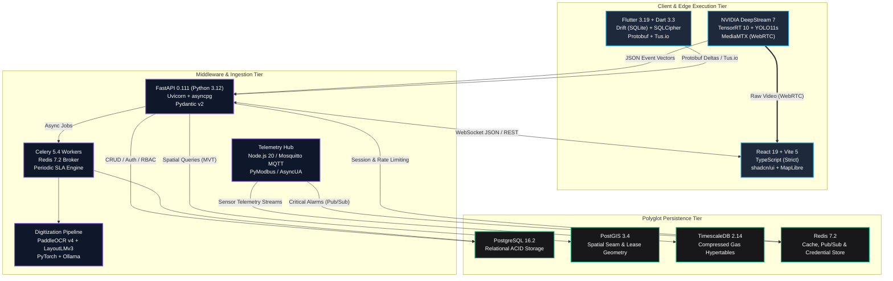
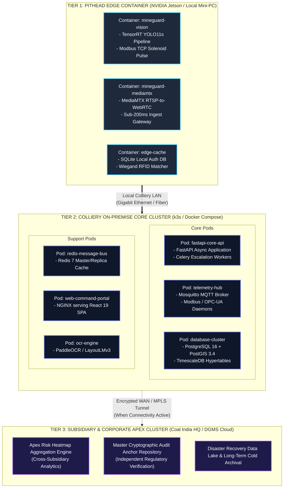

# CoalGuard — Comprehensive Technology Stack & Engineering Matrix

> **Platform Identifier:** AI MineGuard (Mind-The-Mine) / CoalGuard  
> **Document Status:** Active / Production Baseline  
> **Version:** 2.4.0  
> **Regulatory Standard:** National-Scale Enterprise Governance, Telemetry Orchestration & Edge Safety System (CMR 2017)  
> **Target Audience:** Systems Architects, DevOps/DevSecOps Engineers, Embedded Systems Engineers, Technical Auditors

---

## Executive Summary

The **CoalGuard** technical stack is engineered to bridge the digital and physical divide in Indian coal mining operations. Operating across opencast surface voids and deep, gassy sub-surface seams, the platform delivers zero-trust edge autonomy, low-latency computer vision, polyglot persistence, resilient offline synchronization, and mathematically verifiable audit non-repudiation.

---

## Table of Contents

1. [Architectural Philosophy & Technology Selection Tenets](#1-architectural-philosophy--technology-selection-tenets)
2. [Master System-Wide Technology Stack](#2-master-system-wide-technology-stack)
   - [2.1 Polyglot Architecture & Stack Flow](#21-polyglot-architecture--stack-flow)
   - [2.2 System-Wide Stack Matrix](#22-system-wide-stack-matrix)
3. [Deep-Dive Specification by Module](#3-deep-dive-specification-by-module)
   - [3.1 Module 1: Central Governance, Workforce & Statutory Engine](#31-module-1-central-governance-workforce--statutory-engine)
   - [3.2 Module 2: Industrial Telemetry & Hardware Diagnostic Gateway](#32-module-2-industrial-telemetry--hardware-diagnostic-gateway)
   - [3.3 Module 3: Pithead Checkpoint Computer Vision Engine](#33-module-3-pithead-checkpoint-computer-vision-engine)
   - [3.4 Module 4: Offline-First Field Inspector & Underground Audit Client](#34-module-4-offline-first-field-inspector--underground-audit-client)
   - [3.5 Module 5: Multimodal Document Digitization Engine (OCR & NER)](#35-module-5-multimodal-document-digitization-engine-ocr--ner)
   - [3.6 Module 6: Command & Control Center, Web Portal & GIS](#36-module-6-command--control-center-web-portal--gis)
4. [Complete Technology Matrix & Version Locking](#4-complete-technology-matrix--version-locking)
5. [DevSecOps, Containerization & Colliery Deployment Topology](#5-devsecops-containerization--colliery-deployment-topology)
   - [5.1 Multi-Tier Container & Execution Architecture](#51-multi-tier-container--execution-architecture)
   - [5.2 Physical Deployment Topology Map](#52-physical-deployment-topology-map)
   - [5.3 Build & Container Optimization Strategy](#53-build--container-optimization-strategy)
6. [Architectural Trade-Off Matrix](#6-architectural-trade-off-matrix)

---

## 1. Architectural Philosophy & Technology Selection Tenets

The technical stack of the CoalGuard platform is engineered around five fundamental operational realities of the Indian coal mining ecosystem:

1. **Zero-Trust Edge Autonomy:** Safety-critical access loops (the Pithead Vision Checkpoint) and field reporting (Underground Seam Inspections) cannot rely on public internet or centralized cloud connectivity. Edge systems must compute, arbitrate, and persist locally with zero dependency on the central server.
2. **Polyglot Persistence Layering:** Relational governance audits, spatial underground galleries, high-frequency atmospheric gas telemetry, and volatile worker authorizations demand distinct database paradigms rather than a monolithic database compromise.
3. **Strict Decoupling of Video and Metadata:** In-process Python/OpenCV video streaming is prohibited. Video streaming is delegated to compiled low-latency WebRTC media servers, while AI analytics emit lightweight spatial vectors over asynchronous WebSockets.
4. **Hardware-Agnostic Middleware Ingestion:** The platform does not enforce custom hardware fabrication; it acts as an industrial integration overlay normalizing legacy SCADA, PLC, and telemetry inputs across disparate colliery subsidiaries.
5. **Provable Audit Non-Repudiation:** Compliance state transitions, statutory shift logs, and gate overrides are bound by linear cryptographic hash-chaining to eliminate retrofitted and backdated record tampering.

---

## 2. Master System-Wide Technology Stack

### 2.1 Polyglot Architecture & Stack Flow



---

### 2.2 System-Wide Stack Matrix

| Architectural Layer | Core Technology / Framework | Runtime / Language | Key Libraries & Tooling | Primary Operational Role |
| :--- | :--- | :--- | :--- | :--- |
| **Module 1: Central Governance** | FastAPI | Python 3.12+ (Async) | Pydantic v2, SQLAlchemy 2.0 (Async), Alembic, Celery | RBAC, SLA state machine, hash-chained audit ledger, report generation. |
| **Module 2: Telemetry Gateway** | Node.js / Python Daemon | Node.js 20 LTS / Python 3.12 | `pymodbus`, `asyncua`, Eclipse Mosquitto, RabbitMQ | Ingestion and normalization of SCADA, PLC, Modbus, OPC-UA, and MQTT telemetry. |
| **Module 3: Vision Edge Gate** | NVIDIA DeepStream / TensorRT | C++ / Python 3.11 | YOLO11s (INT8/FP16), OpenCV, MediaMTX (WebRTC) | Sub-500ms optical wear-state detection (`hardhat_worn`, `vest_worn`, `scsr_worn`). |
| **Module 4: Field Mobile App** | Flutter | Dart 3.3+ | Drift (SQLite), Dio, Protobuf, Tus.io client | Offline-first CMR Form IV digital logs, BLE/NFC gallery tagging, delta sync. |
| **Module 5: Multimodal OCR/NER** | PaddleOCR v4 + LayoutLMv3 | Python 3.11 | OpenCV, PyTorch, Hugging Face Transformers, Ollama | Degraded document pre-processing, certificate parsing, expiration tracking. |
| **Module 6: Command Center Web** | React 19 | TypeScript 5.4+ (Strict) | Vite 5, Tailwind CSS, shadcn/ui, MapLibre GL, Recharts | Low-latency WebRTC gate HUD, spatial digital twin, diagnostic health matrix. |
| **Primary Relational Store** | PostgreSQL 16 | SQL / C | Standard Relational Engine, B-Tree & GIN Indexes | Core enterprise data, worker profiles, statutory tickets, cryptographic hashes. |
| **Spatial Database Extension** | PostGIS 3.4 | C / Geometry Engine | GEOS, Proj, `ST_Contains`, `ST_Intersects` | Surface lease boundaries, blast buffers, 2D/3D underground seam centerlines. |
| **Time-Series Engine** | TimescaleDB 2.14+ | PostgreSQL Extension | Hypertables, Chunk Compression, Continuous Aggregates | High-frequency atmospheric telemetry ($\text{CH}_4$, $\text{CO}$, $\text{O}_2$, Air Velocity). |
| **In-Memory Cache & Message Bus** | Redis 7.2 | C / In-Memory | Redis Streams, Pub/Sub, Redis Sentinel | Sub-millisecond credential lookups, rate limiting, WebSocket pub/sub. |

---

## 3. Deep-Dive Specification by Module

### 3.1. Module 1: Central Governance, Workforce & Statutory Engine

#### Runtime & Core Framework
* **Python 3.12+:** Leverages enhanced asynchronous task execution, sub-interpreter performance optimizations, and strict typing.
* **FastAPI 0.111+:** High-performance asynchronous API framework utilizing Starlette and Pydantic v2 for automatic schema validation, serialized performance, and automated OpenAPI documentation generation.
* **Uvicorn (Gunicorn Managed):** Production ASGI server deployment using `uvloop` and `httptools` high-concurrency worker pools.

#### Database ORM & Migrations
* **SQLAlchemy 2.0 (Async Engine):** Complete separation of expression language and mapped schemas using `async_sessionmaker` and `asyncpg` driver for non-blocking I/O queries.
* **Alembic:** Structured database schema migration management tied into CI/CD pipelines to guarantee schema parity across development and colliery deployments.

#### Asynchronous Task Execution & Scheduling
* **Celery 5.4+ / Redis 7:** Dedicated distributed task queues handling heavy asynchronous workflows:
  * *SLA Escalation Worker:* Periodic 60-second scanning loop querying unresolved compliance notices against statutory deadlines.
  * *Statutory Report Compiler:* Background aggregation worker compiling multi-table shift data into pre-formatted PDF exports.
  * *Cryptographic Anchoring Task:* Batch verification and anchoring of linear hash-chains.

#### Security, Cryptography & Authentication
* **Passlib (Argon2id / Bcrypt):** Industry-standard memory-hard password hashing protecting user records against GPU-accelerated brute-force attacks.
* **Python-Jose:** Cryptographic signing and validation of JSON Web Tokens (JWT) containing encoded statutory role claims and permitted workspace scopes.
* **Hashlib (SHA-256 Engine):** Hardware-accelerated computation of audit hashes enforcing linear audit integrity:

$$\text{Hash}_n = \text{SHA256}\left(\text{Hash}_{n-1} \parallel \text{Timestamp} \parallel \text{UserID} \parallel \text{Payload}\right)$$

---

### 3.2. Module 2: Industrial Telemetry & Hardware Diagnostic Gateway

#### Message Brokers & Protocol Normalization
* **Eclipse Mosquitto 2.0+:** Ultra-lightweight, high-throughput MQTT broker handling localized telemetry broadcasts from field sensors and IoT gateways.
* **RabbitMQ 3.13 (AMQP 0-9-1):** Enterprise message queue orchestrating complex telemetry routing, dead-letter exchanges, and worker distribution across multiple colliery hubs.

#### Industrial Protocol Drivers
* **PyModbus 3.6+ (Python) / modbus-serial (Node.js):** Communicates with turnstile lock solenoids, digital status relays, and passage sensors over Modbus TCP/RTU.
* **AsyncUA (Python) / node-opcua:** Asynchronous OPC-Unified Architecture client connecting to colliery-level SCADA systems, programmable logic controllers (PLCs), and main ventilation fans.
* **Wiegand-to-TCP Adapters:** Normalizes raw pulse data emitted from cap-lamp RFID badge readers into standard TCP network socket packets.

#### Diagnostics & Health Polling Engine
* **Active Heartbeat Daemon:** Continuously polls industrial endpoints across rolling 10-second windows:
  * *RTSP Video Feed Ping:* Verifies transport integrity and frame decodability from checkpoint cameras.
  * *Modbus Relay Link Check:* Validates gateway communication and mechanical turnstile health.
  * *ETD Telemetry Frequency:* Flags sensors failing to report within statutory reporting windows.

---

### 3.3. Module 3: Pithead Checkpoint Computer Vision Engine

#### Edge Hardware Target
* **Primary Edge Compute:** NVIDIA Jetson Orin Nano (8GB) / AGX Orin (for multi-lane shaft collars) or Industrial Edge PCs equipped with NVIDIA RTX GPUs.
* **Host OS:** Ubuntu 22.04 LTS (Linux for Tegra - L4T / JetPack 6.x).

#### Deep Learning Architecture & Optimization
* **Detection Model:** YOLO11s (Single-stage state detector, ~9.4M parameters).
* **Trained Target Classes:** `hardhat_worn`, `head_bare`, `hardhat_held`, `vest_worn`, `vest_missing`, `scsr_worn`, `scsr_missing`.
* **Inference Resolution:** $640 \times 640$ pixels.
* **Optimization & Quantization:** NVIDIA TensorRT 10.x. Converts PyTorch `.pt` checkpoints into execution engines using FP16 and INT8 calibration to achieve $\le 4.5\text{ms}$ latency per frame on edge silicon.
* **Edge Pipeline Orchestration:** NVIDIA DeepStream SDK 7.x or custom C++/GStreamer pipelines with zero-copy unified memory buffers directly consuming RTSP streams from H.264 IP cameras.

#### Real-Time Video Delivery
* **MediaMTX:** High-performance, zero-latency Go-based media server. Ingests raw camera RTSP streams and transcodes directly to WebRTC (H.264 passthrough) for low-latency ($\le 200\text{ms}$) in-browser rendering, bypassing Python web processes completely.

---

### 3.4. Module 4: Offline-First Field Inspector & Underground Audit Client

#### Core Mobile Framework
* **Flutter 3.19+ / Dart 3.3+:** Native compilation to Android and iOS runtimes ensuring deterministic 60 FPS rendering on ruggedized industrial tablets (e.g., Samsung Galaxy Tab Active series or intrinsically safe Ex-certified handhelds).

#### Local Storage & Database Engine
* **Drift 2.16+:** Type-safe, reactive persistence layer built on top of SQLite.
* **Isolated Background Threading:** Executes all read/write queries on dedicated Dart isolates, preventing UI stutter when committing large inspection logs.
* **SQLCipher:** Provides 256-bit AES encryption-at-rest for on-device databases, ensuring data security if a physical tablet is compromised.

#### Sync Transport & Serialization
* **Protocol Buffers (Protobuf v3):** Encodes offline inspection records into compact binary payloads, reducing payload sizes by 65–75% compared to verbose JSON over weak shaft-bottom Wi-Fi.
* **Dio 5.4+:** Robust HTTP networking client with custom interceptors for token refresh, exponential backoff retry algorithms, and network state monitoring (`connectivity_plus`).
* **Tus.io Protocol (Tus-Client):** Open standard for resumable file uploads, guaranteeing that multi-megabyte evidence images survive interrupted network transfers.

#### Hardware Sensor Interfaces
* **`flutter_nfc_kit`:** Interacts with fixed high-frequency NFC tags mounted on underground gallery roof supports to capture topological location proofs (`Seam -> District -> Dip/Pillar`).
* **`flutter_reactive_ble`:** Background Bluetooth Low Energy scanner detecting gallery BLE beacons for ambient underground location tagging.
* **`image` & `flutter_image_compress`:** Immediate client-side conversion of camera snapshots to WebP format at 80% quality, reducing a 4MB raw photo to $< 350\text{KB}$ prior to disk write.

---

### 3.5. Module 5: Multimodal Document Digitization Engine (OCR & NER)

#### Optical Character Recognition (OCR) Pipeline
* **PaddleOCR v4:** Primary text recognition engine. Features a deep text detection (DBNet) and recognition (SVTR) architecture fine-tuned for high accuracy on noisy, degraded, and low-contrast industrial documents.
* **OpenCV 4.9+ (Python Headless):** Pre-processing image enhancement pipeline:
  * Adaptive Gaussian thresholding and binarization.
  * Hough Transform deskewing algorithms to correct angled camera scans.
  * Bilateral filtering to remove physical dust and smudge artifacts from field logbooks.

#### Information Extraction & Entity Recognition
* **LayoutLMv3 (Hugging Face Transformers):** Multi-modal transformer integrating visual layout geometry and text embeddings to parse complex tabular forms (CMR Form IV shift summaries, DGMS statutory licenses).
* **Ollama / Llama-3.2-3B-Instruct (Edge Fallback):** Local, lightweight instruction-tuned language model deployed via `llama.cpp` to extract structured JSON entities conforming to strict Pydantic schemas without data leaving the colliery network.

---

### 3.6. Module 6: Command & Control Center, Web Portal & GIS

#### Core Framework & Build Architecture
* **React 19:** Leverages Actions, optimized Server/Client component boundaries, and enhanced memoization compilers.
* **TypeScript 5.4+:** Strict compilation (`noImplicitAny: true`, `strictNullChecks: true`) ensuring end-to-end interface contracts across APIs and UI components.
* **Vite 5+:** Rollup-based rapid development bundler utilizing manual chunk splitting to keep vendor bundles under $250\text{KB}$.

#### Design System & Component Library
* **Tailwind CSS 3.4+:** Utility-first styling utilizing custom Slate/Zinc dark-mode design tokens.
* **shadcn/ui (Radix UI Primitives):** Unstyled, fully accessible UI components (DataTables, Dialogs, Dropdowns, Sheets, Popovers) styled directly with Tailwind CSS.
* **Lucide React:** Vector iconography library providing clean, professional industrial visual anchors (strictly zero unicode emojis).

#### State Management & Data Fetching
* **TanStack Query v5 (React Query):** Asynchronous server-state management handling background refetching, cache invalidation, and optimistic UI mutations for compliance tickets.
* **Zustand 4.5+:** Lightweight, boilerplate-free client state store managing active workspace selection, sidebar toggles, audio alert mutes, and camera grid configurations.

#### Geospatial & Data Visualization
* **MapLibre GL JS 4.x:** WebGL-accelerated vector mapping engine rendering surface colliery cadastral lines, blast-zone radial geofences, and 2D underground seam gallery centerlines at 60 FPS.
* **Recharts 2.12+:** Responsive SVG charting engine delivering customizable, dark-themed time-series visualizations of continuous atmospheric telemetry ($\text{CH}_4$, $\text{CO}$, Air Velocity).

---

## 4. Complete Technology Matrix & Version Locking

| Tier | Component | Version | Licensing | Primary Dependency / Driver |
| :--- | :--- | :--- | :--- | :--- |
| **Backend Core** | FastAPI | `0.111.0` | MIT | Starlette, Pydantic v2 |
| | Python Runtime | `3.12.3` | PSF | CPython 64-bit |
| | SQLAlchemy | `2.0.30` | MIT | `asyncpg` (PostgreSQL Async Driver) |
| | Alembic | `1.13.1` | MIT | SQLAlchemy Core |
| | Celery | `5.4.0` | BSD-3-Clause | `redis-py` |
| | Pydantic | `2.7.1` | MIT | `pydantic-core` (Rust bindings) |
| **Database Tier** | PostgreSQL | `16.2` | PostgreSQL Lic. | `libpq`, `asyncpg` |
| | PostGIS Extension | `3.4.2` | GPL-2.0 | GEOS, PROJ, GDAL |
| | TimescaleDB | `2.14.2` | Timescale Lic. | PostgreSQL Engine Core |
| | Redis | `7.2.4` | RSALv2 / SSPL | In-Memory Key-Value Store |
| **Edge AI & Vision** | YOLO11s Model | `11.0.0` | AGPL-3.0 | PyTorch / Ultralytics |
| | TensorRT Execution Engine | `10.0.1` | Proprietary | CUDA 12.4, cuDNN 9.x |
| | NVIDIA DeepStream SDK | `7.0` | Proprietary | GStreamer 1.20, GLib 2.0 |
| | MediaMTX Gateway | `1.8.0` | MIT | Go Runtime (WebRTC / RTSP) |
| **Field Mobile** | Flutter SDK | `3.19.6` | BSD-3-Clause | Dart SDK 3.3.4 |
| | Drift (Moor) | `2.16.0` | MIT | `sqlite3`, `sqlcipher_flutter_libs` |
| | Dio Networking | `5.4.3` | MIT | `dart:io`, `flutter_core` |
| | Protobuf Engine | `3.25.1` | BSD-3-Clause | `google.protobuf` compiler |
| **Web Frontend** | React Framework | `19.0.0` | MIT | Node.js 20 LTS, JavaScript Core |
| | TypeScript Toolchain | `5.4.5` | Apache-2.0 | `tsc` compiler |
| | Vite Bundler | `5.2.11` | MIT | Rollup, esbuild |
| | Tailwind CSS | `3.4.3` | MIT | `postcss`, `autoprefixer` |
| | MapLibre GL JS | `4.1.2` | BSD-3-Clause | WebGL 2.0 Context |
| | Lucide React Icons | `0.378.0`| ISC | SVG Path Generator |
| **Industrial Comm** | Eclipse Mosquitto | `2.0.18` | EPL-2.0 / EDL-1.0 | C Socket Core |
| | RabbitMQ Broker | `3.13.2` | MPL-2.0 | Erlang/OTP 26 |
| | PyModbus Library | `3.6.8` | BSD-3-Clause | `pyserial`, `asyncio` |

---

## 5. DevSecOps, Containerization & Colliery Deployment Topology

### 5.1 Multi-Tier Container & Execution Architecture

The platform deployment architecture is organized into three execution tiers to guarantee continuous operational capability regardless of external internet availability:



---

### 5.2 Physical Deployment Topology Map

```text
+------------------------------------------------------------------------------------------------------+
| TIER 1: PITHEAD EDGE CONTAINER (NVIDIA Jetson / Local Mini-PC)                                       |
| Docker Engine 26.x running on Ubuntu 22.04 LTS                                                       |
|                                                                                                      |
|  +--------------------------------+  +--------------------------------+  +------------------------+  |
|  | Container: mineguard-vision    |  | Container: mineguard-mediamtx  |  | Container: edge-cache  |  |
|  | - TensorRT YOLO11s Pipeline    |  | - MediaMTX RTSP-to-WebRTC      |  | - SQLite Local Auth DB |  |
|  | - Modbus TCP Solenoid Pulse    |  | - Sub-200ms Ingest Gateway     |  | - Wiegand RFID Matcher |  |
|  +--------------------------------+  +--------------------------------+  +------------------------+  |
+------------------------------------------------------------------------------------------------------+
                                                   │
                                                   │ Local Colliery LAN (Gigabit Ethernet)
                                                   ▼
+------------------------------------------------------------------------------------------------------+
| TIER 2: COLLIERY ON-PREMISE CORE CLUSTER (Lightweight Kubernetes / k3s)                              |
| 3-Node Physical Cluster inside Colliery Computer Room                                                |
|                                                                                                      |
|  +--------------------------------+  +--------------------------------+  +------------------------+  |
|  | Pod: fastapi-core-api          |  | Pod: telemetry-hub             |  | Pod: database-cluster  |  |
|  | - FastAPI Async Application    |  | - Mosquitto MQTT Broker        |  | - PostgreSQL 16/PostGIS|  |
|  | - Celery Escalation Workers    |  | - Modbus/OPC-UA Daemons        |  | - TimescaleDB Hypertbl |  |
|  +--------------------------------+  +--------------------------------+  +------------------------+  |
|                                                                                                      |
|  +--------------------------------+  +--------------------------------+  +------------------------+  |
|  | Pod: redis-message-bus         |  | Pod: web-command-portal        |  | Pod: ocr-engine        |  |
|  | - Redis 7 Master/Replica Cache |  | - NGINX serving React 19 SPA   |  | - PaddleOCR / LayoutLM |  |
|  +--------------------------------+  +--------------------------------+  +------------------------+  |
+------------------------------------------------------------------------------------------------------+
                                                   │
                                                   │ Encrypted WAN / MPLS Tunnel (When Connectivity Active)
                                                   ▼
+------------------------------------------------------------------------------------------------------+
| TIER 3: SUBSIDIARY & CORPORATE APEX CLUSTER (Coal India HQ / DGMS Cloud)                             |
| Multi-AZ Kubernetes Cluster (Bare Metal or Sovereign Cloud)                                         |
|                                                                                                      |
|  * Apex Risk Heatmap Aggregation Engine (Cross-Subsidiary Analytics)                                 |
|  * Master Cryptographic Audit Anchor Repository (Independent Regulatory Verification)                |
|  * Disaster Recovery Data Lake & Long-Term Cold Archival                                             |
+------------------------------------------------------------------------------------------------------+
```

---

### 5.3 Build & Container Optimization Strategy

* **Multi-Stage Docker Builds:** Frontend assets are built using Node.js Alpine environments and copied into unprivileged NGINX scratch images, resulting in production container sizes $< 25\text{MB}$.
* **Wheel Isolation in Python Containers:** Backend microservices compile dependencies inside virtual builder containers, exporting strictly compiled binary wheels to slim Python Debian runtime images to eliminate build toolchain vulnerabilities in production.
* **Edge TensorRT Serialized Engine Mounts:** Deep learning weights are not compiled at container startup. Optimized TensorRT `.engine` files are pre-compiled for the specific compute capability of the hardware (e.g., Orin SM 8.7) and mounted directly as read-only volumes.

---

## 6. Architectural Trade-Off Matrix

| Design Choice Made | Alternative Considered | Technical Rationale & Operational Justification |
| :--- | :--- | :--- |
| **FastAPI (Python Async)** | Spring Boot 3 (Java) or Go (Golang) | Faster AI/ML ecosystem integration (`PyTorch`, `TensorRT`, `PaddleOCR`, `LayoutLMv3`) while retaining asynchronous performance via `asyncpg` and `uvloop`. |
| **Direct Wear-State YOLO** | Skeletal Pose Estimation (17 Keypoints) | Miners at choke gates stand facing the lens. Pose estimation requires additional latency ($+12\text{ms}$) with zero gain; direct wear classes evaluate in $< 5\text{ms}$. |
| **WebRTC via MediaMTX** | Server-Side OpenCV MJPEG Streams | MJPEG consumes $15\times$ more bandwidth, lacks inter-frame compression, and spikes server CPU to 100% on multi-user dashboards. WebRTC offloads video decoding to the client GPU. |
| **Drift (SQLite) on Isolate** | SharedPreferences or raw `sqflite` | Eliminates Android main-thread lockups during multi-record shift syncs; provides compile-time query safety and background isolate execution. |
| **MapLibre GL JS** | Leaflet or Google Maps API | Offline vector tile serving capability via `pg_tileserv` without public internet; WebGL hardware acceleration for thousands of underground gallery lines. |
| **TimescaleDB Extension** | InfluxDB or MongoDB | Retains complete relational foreign-key integrity between environmental sensor readings, mine seam identifiers, and statutory inspection logs in a single query engine. |
| **SHA-256 Hash Chaining** | Public Ethereum / Hyperledger Fabric | Public blockchains violate national data sovereignty and incur gas fees; Hyperledger introduces immense operational overhead. Linear cryptographic hash chaining gives non-repudiation with microsecond latency. |

---

*Document maintained by CoalGuard Architecture & Systems Engineering Team. For stack modifications or library updates, open an architectural review ticket.*
